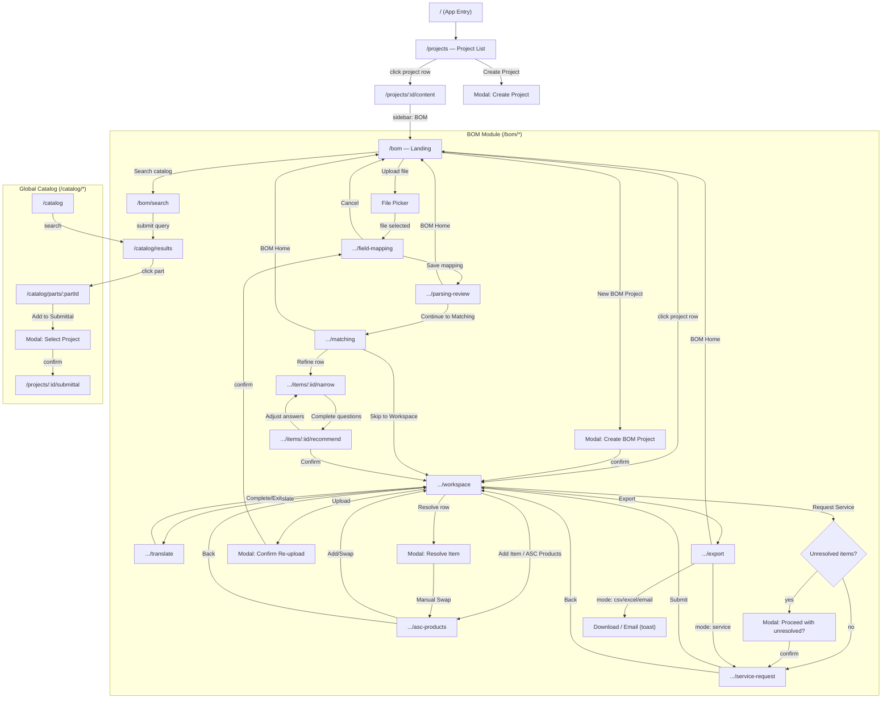

# BOM Application — Complete Userflow & UX Specification

> **Version:** 1.0  
> **Date:** 2026-04-14  
> **Scope:** End-to-end BOM userflow, all screens, edge cases, error states, UX improvement proposals.  
> **Source:** Code audit of `src/bom/`, `src/shell/`, `src/context/`, route definitions, and mock data layer.

---

## Table of Contents

1. [Flow Architecture](#1-flow-architecture)
   - [1.1 Revised Happy Path](#11-revised-happy-path)
   - [1.2 Complete Flow Diagram](#12-complete-flow-diagram)
   - [1.3 Orphaned Page Integration](#13-orphaned-page-integration)
   - [1.4 Dead Code Reactivation](#14-dead-code-reactivation)
2. [Screen-by-Screen Specification](#2-screen-by-screen-specification)
   - [2.0 App Entry & Shell](#20-app-entry--shell)
   - [2.1 BOM Landing](#21-bom-landing)
   - [2.2 BOM Search](#22-bom-search)
   - [2.3 Field Mapping (NEW position)](#23-field-mapping)
   - [2.4 Parsing Review](#24-parsing-review)
   - [2.5 Matching](#25-matching)
   - [2.6 Narrow (per item)](#26-narrow)
   - [2.7 Recommend (per item)](#27-recommend)
   - [2.8 Workspace (Hub)](#28-workspace)
   - [2.9 Product Browser (merged ASC Products + Catalog)](#29-product-browser)
   - [2.10 Translate (Workspace integration)](#210-translate)
   - [2.11 Export](#211-export)
   - [2.12 Service Request](#212-service-request)
   - [2.13 Global Catalog (Shell)](#213-global-catalog)
3. [Edge Cases & Error Handling](#3-edge-cases--error-handling)
   - [3.1 Global Patterns](#31-global-patterns)
   - [3.2 Per-Flow Error Scenarios](#32-per-flow-error-scenarios)
   - [3.3 Recovery Paths](#33-recovery-paths)
4. [UX Improvement Proposals](#4-ux-improvement-proposals)
   - [4.1 Flow Restructuring](#41-flow-restructuring)
   - [4.2 Per-Screen Improvements](#42-per-screen-improvements)
   - [4.3 Proposed Layouts for Unfinished Screens](#43-proposed-layouts-for-unfinished-screens)
5. [State Management Map](#5-state-management-map)
   - [5.1 Page-to-Page State (location.state)](#51-page-to-page-state)
   - [5.2 Context Providers](#52-context-providers)
   - [5.3 Session / Local Storage](#53-session--local-storage)
   - [5.4 Mock Data Layer](#54-mock-data-layer)

---

## 1. Flow Architecture

### 1.1 Revised Happy Path

The current implementation has three orphaned routes (`field-mapping`, `translate`, `catalog`) and four orphaned components (`AscProductsDrawer`, `BomAliasConfigurator`, `PartTranslationModal`, `BomFlowStepper`). The revised flow integrates all of them:

**Primary BOM Flow (8 steps):**

```
1. Landing        — Choose: Upload file, Search catalog, or open existing project
2. Upload         — File picker + validation
3. Field Mapping  — Map BOM columns to ASC fields (NEW position)
4. Parsing Review — Review extracted line items, correct errors
5. Matching       — System matches BOM lines to ASC catalog parts
6. Refine Loop    — Per-item: Narrow (guided Q&A) → Recommend (confirm/reject)
7. Workspace      — Central hub: resolve, swap, translate, add items
8. Export / Service Request — Download files or submit service request
```

**Secondary Flows (branch from Workspace):**
- Product Browser (add/swap ASC products)
- Translate (bulk part translation review)
- Re-upload (loop back to Field Mapping)
- Catalog Search (global catalog, also reachable from sidebar)

---

### 1.2 Complete Flow Diagram



---

### 1.3 Orphaned Page Integration

#### Field Mapping: Upload → **Field Mapping** → Parsing Review

**Current state:** `/bom/projects/:id/field-mapping` exists as a full page with column-to-field mapping UI, but nothing links to it.

**Proposed position:** Insert between file upload and parsing review. After the user picks a file, they land on Field Mapping to tell the system which columns in their BOM correspond to which ASC fields (part number, description, size, pressure class, connection type, quantity, etc.).

**Rationale:**
- Column mapping must happen before parsing to produce meaningful results.
- Users upload BOM files from different vendors with different column naming conventions.
- The system cannot reliably auto-detect all column meanings.
- If the user has uploaded before and a saved mapping exists, this step can be **pre-filled and skippable** (auto-advance with a "Change mapping" link on Parsing Review).

**Flow change:**
```
BEFORE: Upload → /parsing-review (field mapping orphaned)
AFTER:  Upload → /field-mapping → /parsing-review
```

#### Translate: Workspace bulk action

**Current state:** `/bom/projects/:id/translate` exists as a full wizard page. `handleTranslateParts()` and `canTranslate` exist in WorkspacePage code but no button triggers them. `PartTranslationModal` component exists but is never imported.

**Proposed integration (two modes):**
1. **Bulk Translate button** on Workspace toolbar (visible when `canTranslate` is true — i.e., there are unresolved items). Clicking it navigates to the Translate page for a sequential review of all unresolved items.
2. **Per-item Translate** via the Resolve Modal — add a "Review Translation" action that opens `PartTranslationModal` for a single item inline.

**Flow change:**
```
BEFORE: Translate is orphaned, handleTranslateParts has no trigger
AFTER:  Workspace toolbar shows [Translate All] when unresolved items exist
        Workspace Resolve Modal gains [Review Translation] for per-item review
```

#### BOM Catalog: Merge with ASC Products

**Current state:** Both `/bom/projects/:id/catalog` and `/bom/projects/:id/asc-products` render nearly identical tables from the same data structure. Both have non-functional "Pre-Products / Quantity Part" tabs.

**Proposed merge:** Remove `BomCatalogPage` as a separate route. Consolidate into `BomAscProductsPage` (renamed "Product Browser") with tabs that actually differentiate content:
- **Tab 1: Pre-engineered Products** — Full assemblies / kits (e.g., "Seismic Brace Kit 4in")
- **Tab 2: Individual Parts** — Single components (e.g., "Pipe Clamp 4in")
- **Tab 3: Quantity Parts** — Commodity items ordered by quantity (e.g., "Threaded Rod 3/8in x 12ft")

**Flow change:**
```
BEFORE: Two overlapping pages with identical content
AFTER:  Single "Product Browser" with meaningful tab segmentation
```

---

### 1.4 Dead Code Reactivation

| Component | Current State | Proposed Role |
|-----------|--------------|---------------|
| `BomFlowStepper` | Defined, never imported | Persistent progress bar in `BomLayout` for all flow pages (steps 1-8). Shows current position in the linear flow. Hidden on Landing and Search. |
| `AscProductsDrawer` | Defined, never imported | Quick-add product picker **drawer** triggered from Workspace "Add Item" button. For adding a single product without navigating away. The full Product Browser page is for browsing/filtering extensively. |
| `BomAliasConfigurator` | Defined, never imported | Re-mapping modal accessible from Parsing Review page ("Change column mapping" link). Allows adjusting field mapping without restarting the full Field Mapping page. |
| `PartTranslationModal` | Defined, never imported | Per-item translation review modal triggered from Workspace Resolve Modal ("Review Translation" action). |

---

## 2. Screen-by-Screen Specification

### 2.0 App Entry & Shell

#### `/` → redirect to `/projects`

**Purpose:** App root redirects to the project list.

#### `/projects` — Project List (`ShellHomeContent`)

**Purpose:** Browse and manage construction projects.

| Element | Action | Destination | State |
|---------|--------|-------------|-------|
| Project row (click) | Navigate | `/projects/:projectId/content` | Functional |
| **Create Project** button | Open creation flow | — | NOT FUNCTIONAL (no handler) |
| Star column | Toggle star | local state only | Partial (no persistence) |
| Tabs (Recent, Starred, All) | Filter table | local state | Functional |
| Search input | Filter by name | — | NOT FUNCTIONAL (not wired) |

**Error states:**
- No projects: Show `Empty` with "No projects found. Create your first project to get started." and a Create Project CTA.
- No matches for filter/tab: Show `Empty` with "No projects match your filter." and a clear-filter action.

**Empty states:**
- Starred tab with no starred projects: "You haven't starred any projects yet. Star a project to pin it here."

**Proposed fixes:**
- Wire Create Project button to a modal (similar to `BomCreateProjectModal`).
- Wire search input to filter `PROJECT_SEED_ROWS` by name.

---

#### `/projects/:projectId/content` — Project Hub

**Purpose:** Module hub for a construction project. Sidebar navigates between modules.

**Current state:** Stub paragraph only.

**Proposed layout:**
```
┌─────────────────────────────────────────────────┐
│  Project: "Downtown Office Tower"               │
│  Client: ABC Corp | Location: Chicago, IL       │
├─────────────────────────────────────────────────┤
│                                                 │
│  ┌─────────┐  ┌─────────┐  ┌─────────┐         │
│  │  BOM    │  │ Submittal│  │SeisBrace│         │
│  │  3 runs │  │  12 docs │  │  Setup  │         │
│  └─────────┘  └─────────┘  └─────────┘         │
│                                                 │
│  Recent Activity                                │
│  ─────────────                                  │
│  • BOM "Mechanical Piping" — 85% matched        │
│  • Submittal "Rev 2" — exported 2h ago          │
│  • SeisBrace layout — draft saved               │
│                                                 │
│  Quick Actions                                  │
│  ─────────────                                  │
│  [Upload BOM]  [Browse Catalog]  [New Submittal]│
│                                                 │
└─────────────────────────────────────────────────┘
```

---

#### `/dashboard` — Dashboard Placeholder

**Current state:** One paragraph + "Back to Projects" link.

**Proposed layout:** Cross-project overview dashboard showing:
- Total active projects (card)
- BOM runs in progress (card with progress bars)
- Recent activity feed (timeline)
- Quick action buttons (New Project, Upload BOM, Browse Catalog)

---

#### AppTopBar Actions

| Element | Current State | Proposed Behavior |
|---------|--------------|-------------------|
| Title "BOM" | Static | Keep as-is |
| Switch Project (dropdown) | Functional — opens modal, changes `ActiveProjectContext` | Keep as-is |
| Help icon | No handler | Open help panel / docs link / support contact |
| Notifications icon | No handler | Open notification drawer with recent BOM events (match complete, export ready, service request update) |
| Account/Avatar dropdown | No handler | Profile settings, theme toggle, sign out |

---

#### Sidebar Navigation

| Item | Path | State |
|------|------|-------|
| Homepage | `/dashboard` | Stub |
| Projects | `/projects` | Functional |
| SeisBrace | `/projects/:pid/seis-brace` | Stub |
| Spec | — | No route |
| Submittal | `/projects/:pid/submittal` | Partial |
| BOM | `/bom` | Functional |
| Content | `/projects/:pid/content` | Stub |
| **Catalog** (MISSING) | `/catalog` | Should be added to sidebar |

**Proposed fix:** Add "Catalog" as a sidebar item between Submittal and BOM. Currently `/catalog` is only reachable via BOM Search or direct URL.

**Bug fix:** Sidebar active item does not highlight correctly on `/catalog` paths — it falls back to "Homepage". Fix `primarySideKey()` to recognize `/catalog` prefix.

---

### 2.1 BOM Landing

**Route:** `/bom`  
**Component:** `BomLandingPage`  
**Purpose:** Entry point for the BOM module. Create or open BOM projects, or start a new upload.

#### Entry Conditions
- User navigates via sidebar "BOM" link
- User navigates via breadcrumb or back navigation
- Direct URL

#### UI Elements & Actions

| Element | Action | Destination |
|---------|--------|-------------|
| Hero Card: "Upload a File" | Opens hidden file input | On file select: navigate to `/bom/projects/new/field-mapping` (revised) |
| Hero Card: "Search Catalogue Parts" | Navigate | `/bom/search` |
| **New BOM Project** button (top-right) | Open `BomCreateProjectModal` | On create: `/bom/projects/:newId/workspace` |
| Project table — row name / edit icon | Navigate | `/bom/projects/:id/workspace` |
| Project table — delete icon | Remove from local state | Stay on page |
| **Back** link | Navigate | `/bom/flow` |

#### Data Requirements
- `ActiveProjectContext.projectId` — filters BOM projects to current construction project
- `mockBomProjects` — filtered by `projectId` and excluding locally deleted IDs
- File upload accepts: `.csv`, `.xlsx`, `.xls`, `.pdf` (validate MIME type)

#### Error States

| Condition | UI | Recovery |
|-----------|-----|---------|
| Upload wrong MIME type | `message.error("Please upload a CSV, Excel, or PDF file")` | User retries with correct file |
| Upload file too large (>50MB) | `message.error("File size exceeds 50MB limit")` | User reduces file or splits |
| Upload network failure | `message.error("Upload failed. Please check your connection and try again.")` with retry button | Retry button re-triggers upload |
| Delete project fails | `message.error("Could not delete project")` | Row remains; user retries |

#### Empty States

| Condition | UI |
|-----------|-----|
| No BOM projects for active construction project | Illustrated empty state: "No BOM projects yet for [Project Name]. Upload a file or create a new project to get started." with Upload and Create CTAs |
| Table filter matches nothing | `Empty`: "No results match your search. Try a different term or clear filters." with clear-filter action |
| No active construction project selected | Banner: "Select a construction project from the top bar to see BOM projects." |

#### Loading States
- File upload: Show progress indicator and "Processing your file..." message with cancel button.
- Table: Skeleton rows while loading project list.

---

### 2.2 BOM Search

**Route:** `/bom/search`  
**Component:** `BomSearchPage`  
**Purpose:** Search the ASC catalog from within the BOM context.

#### Entry Conditions
- User clicks "Search Catalogue Parts" on BOM Landing
- Direct URL with optional `?q=` param

#### UI Elements & Actions

| Element | Action | Destination |
|---------|--------|-------------|
| Search input + "Search Catalog" button | Navigate with query | `/catalog/results?q=<query>` |
| Example query chips | Pre-fill search input | Same |
| **Back** button | Navigate | `/bom` (CHANGED from `/bom/flow`) |

#### Error States

| Condition | UI | Recovery |
|-----------|-----|---------|
| Empty query submitted | Prevent submission; show inline validation "Enter a search term" | User types query |
| Search service unavailable | `message.error("Catalog search is temporarily unavailable")` | Retry button |

#### Empty States
- N/A (this page is a search input, not a results page)

**UX note (fix):** Back button currently goes to `/bom/flow` which is a demo-only page. Should go to `/bom` (the BOM Landing).

---

### 2.3 Field Mapping

**Route:** `/bom/projects/:bomProjectId/field-mapping`  
**Component:** `BomFieldMappingPage`  
**Purpose:** Map columns from the uploaded BOM file to standard ASC data fields before parsing.

#### Entry Conditions (REVISED)
- After file upload from BOM Landing (NEW primary entry)
- Re-mapping from Parsing Review ("Change mapping" link)
- Re-upload from Workspace confirm modal

#### UI Elements & Actions

| Element | Action | Destination |
|---------|--------|-------------|
| Column mapping rows (Select dropdowns) | Map BOM column → ASC field | Local state |
| Preview panel (right side) | Shows sample rows from uploaded file with current mapping applied | — |
| Mapping status indicator | Shows mapped/unmapped count | — |
| **Save Mapping** button | Validate and navigate | `/bom/projects/:bomProjectId/parsing-review` |
| **Reset to Defaults** button | Revert mapping | Stay on page |
| **Cancel** button | Navigate | `/bom/projects/:bomProjectId/workspace` (if project exists) or `/bom` |

#### Data Requirements
- Uploaded file column headers (extracted from first row of CSV/Excel)
- `ASC_DEST_FIELDS` — standard ASC field definitions
- `BOM_SOURCE_FIELDS` — detected source columns from file
- Optional: previously saved mapping for this file format (auto-detection)

#### Error States

| Condition | UI | Recovery |
|-----------|-----|---------|
| No columns detected from file | Error banner: "Could not detect columns in the uploaded file. Please check the file format." | Back to Landing to re-upload |
| Required fields unmapped (part ID, description, quantity) | Warning banner + disabled Save: "Map at least Part Number, Description, and Quantity to continue." | User maps required fields |
| Duplicate mapping (two BOM columns → same ASC field) | Inline warning on conflicting rows: "This field is already mapped." | User changes one mapping |

#### Empty States
- N/A (page always has content from the uploaded file)

#### Loading States
- File analysis: Skeleton preview panel with "Analyzing file structure..." while detecting columns.

#### Proposed Layout

```
┌────────────────────────────────────────────────────────────────┐
│  ← Back to BOM                                                 │
│                                                                 │
│  Step 3 of 8: Map Your Columns            Mapping: 5/8 fields  │
│  ────────────────────────────────────────────────────────────── │
│                                                                 │
│  ┌──────────────────────────────┬───────────────────────────┐  │
│  │  YOUR BOM COLUMNS           │  FILE PREVIEW              │  │
│  │                              │                            │  │
│  │  "Part No."   → [Part Number ▾]  │  Row 1: A105-B | ...  │  │
│  │  "Desc"       → [Description ▾]  │  Row 2: C200-X | ...  │  │
│  │  "Size"       → [Size        ▾]  │  Row 3: P300-Z | ...  │  │
│  │  "Pressure"   → [Pressure Cl.▾]  │  ...                  │  │
│  │  "QTY"        → [Quantity    ▾]  │                        │  │
│  │  "Connection" → [Connection  ▾]  │                        │  │
│  │  "Unit"       → [— Skip —   ▾]  │                        │  │
│  │  "Notes"      → [— Skip —   ▾]  │                        │  │
│  │                              │                            │  │
│  │  [Reset to Defaults]         │  Showing 5 of 247 rows    │  │
│  └──────────────────────────────┴───────────────────────────┘  │
│                                                                 │
│  ⚠ "Category" is not mapped. Matching accuracy may be lower.   │
│                                                                 │
│                        [Cancel]   [Save Mapping & Continue →]   │
└────────────────────────────────────────────────────────────────┘
```

---

### 2.4 Parsing Review

**Route:** `/bom/projects/:bomProjectId/parsing-review`  
**Component:** `BomParsingReviewPage`  
**Purpose:** Review and correct the system-parsed line items from the uploaded BOM file.

#### Entry Conditions
- After Field Mapping "Save & Continue"
- From Workspace "Upload" re-upload flow
- From BOM Flow Overview demo links

#### UI Elements & Actions

| Element | Action | Destination |
|---------|--------|-------------|
| Parsed items table | Read-only (CURRENT) / Inline-editable (PROPOSED) | — |
| **Continue to Matching** (primary) | Navigate | `/bom/projects/:bomProjectId/matching` |
| **BOM Home** link | Navigate | `/bom` |
| **Change Column Mapping** link (PROPOSED) | Open `BomAliasConfigurator` modal | Stay on page, re-parse after save |
| Row-level correction (PROPOSED) | Inline edit cell values | Stay on page |

#### Data Requirements
- `mockParsedItems` — parsed line items (currently same for every project)
- `bomProjectId` for project title

#### Error States

| Condition | UI | Recovery |
|-----------|-----|---------|
| Parsing returned 0 items | Error state: "No items could be parsed from your file. Check the file format or adjust column mapping." with [Change Mapping] and [Re-upload] CTAs | Navigate to Field Mapping or Landing |
| Some rows have parsing errors | Rows highlighted with warning icon. Banner: "3 items could not be fully parsed. Review highlighted rows." | User corrects inline |
| Unknown `bomProjectId` | Full-page error: "BOM project not found." with [Go to BOM Home] | Navigate to `/bom` |

#### Empty States
- File with headers only, no data rows: "The uploaded file contains only headers. Upload a file with data rows." with [Re-upload] CTA.

#### Loading States
- Parsing in progress: Skeleton table with "Parsing your BOM file..." and progress percentage.

**Key improvement:** Make table cells **inline-editable** (click-to-edit). Users need to correct OCR errors, typos, and misclassified values before matching. Currently the table is read-only which forces users to accept incorrect data.

---

### 2.5 Matching

**Route:** `/bom/projects/:bomProjectId/matching`  
**Component:** `BomMatchingPage`  
**Purpose:** Display system-generated matches between BOM line items and ASC catalog parts.

#### Entry Conditions
- After Parsing Review "Continue to Matching"
- Return from Narrow/Recommend flow

#### UI Elements & Actions

| Element | Action | Destination |
|---------|--------|-------------|
| Match results table | View matches with confidence/risk tags | — |
| **Refine** link on row | Navigate | `/bom/projects/:bomProjectId/items/:itemId/narrow` |
| **Skip to Workspace** (primary) | Navigate | `/bom/projects/:bomProjectId/workspace` |
| **BOM Home** link | Navigate | `/bom` |
| Bulk actions (PROPOSED) | "Accept All High-Confidence" / "Refine All Low-Confidence" | Batch update |

#### Data Requirements
- `mockMatchResults` — match results per item
- `mockParsedItems` — original BOM lines for reference

#### Error States

| Condition | UI | Recovery |
|-----------|-----|---------|
| Matching engine failure | Error banner: "Matching could not be completed. Try again or proceed to workspace for manual matching." with [Retry] and [Go to Workspace] | Retry or skip |
| 0 matches found for all items | Warning state: "No automatic matches were found. This may indicate a mapping issue. You can proceed to the workspace for manual product selection." with [Change Mapping] and [Go to Workspace] | Navigate |
| Item has no match candidates | Row shows "No matches — manual selection required" with Refine link | User refines or manual-selects in Workspace |

#### Empty States
- N/A (table always renders from parsed items, even if matches are empty per row)

#### Loading States
- Matching in progress: Full-page skeleton with "Running matching engine..." progress bar. Show step: "Analyzing 247 items... 156/247 complete"

---

### 2.6 Narrow (Per Item)

**Route:** `/bom/projects/:bomProjectId/items/:itemId/narrow`  
**Component:** `BomNarrowPage`  
**Purpose:** Guided Q&A to narrow down the correct ASC product for a specific BOM line item.

#### Entry Conditions
- "Refine" link from Matching table
- "Adjust answers" from Recommend page

#### UI Elements & Actions

| Element | Action | Destination |
|---------|--------|-------------|
| Stepper showing current question | Orientation only | — |
| Radio button options for current question | Select answer | Local state |
| **Next** button | Advance to next question | Next question or → Recommend |
| **Previous** button | Go back one question | Previous question |
| **Skip Question** (PROPOSED) | Skip without answering | Next question |
| **Cancel** (PROPOSED) | Navigate | Back to Matching |

#### Data Requirements
- `bomItemById(itemId)` — the specific BOM line
- `mockGuidedQuestions` — question set (currently global, should be per-item category)

#### Error States

| Condition | UI | Recovery |
|-----------|-----|---------|
| Unknown `itemId` | Error state: "Line item not found. It may have been removed." with [Back to Matching] | Navigate to Matching |
| No questions available for item category | Skip to Recommend directly with message: "No additional questions needed for this item type." | Auto-navigate |

#### Empty States
- N/A (always has questions)

**UX improvement:** Add a **Cancel/Back to Matching** link so users can abandon the narrow flow without completing all questions. Currently there is no escape hatch except browser back.

---

### 2.7 Recommend (Per Item)

**Route:** `/bom/projects/:bomProjectId/items/:itemId/recommend`  
**Component:** `BomRecommendPage`  
**Purpose:** Present the recommended ASC part based on narrowing answers.

#### Entry Conditions
- After completing all Narrow questions

#### UI Elements & Actions

| Element | Action | Destination |
|---------|--------|-------------|
| Recommended part card + comparison | View | — |
| **Confirm and Go to Workspace** (primary) | Navigate | `/bom/projects/:bomProjectId/workspace` |
| **Adjust Answers** | Navigate | `/bom/projects/:bomProjectId/items/:itemId/narrow` |
| **Try Different Product** (PROPOSED) | Navigate | Product Browser in swap mode |
| **Skip (Accept As-Is)** (PROPOSED) | Navigate to Workspace, mark item as needs-review | Workspace |

#### Data Requirements
- `bomItemById(itemId)` — BOM line item
- `matchResultForItem(itemId)` — match results with `topMatch`

#### Error States

| Condition | UI | Recovery |
|-----------|-----|---------|
| Item not found | "Recommendation unavailable" state | [Back to Matching] link |
| No match result for item | "No recommendation could be generated. Try adjusting your answers or select a product manually." | [Adjust Answers] or [Browse Products] |
| Match has very low confidence (<30%) | Warning: "This match has low confidence (28%). Consider browsing products manually." | [Browse Products] |

#### Empty States
- No `topMatch` in results: Full comparison section hidden. Show "No suitable match was found. Try adjusting your answers or browse products manually."

---

### 2.8 Workspace (Hub)

**Route:** `/bom/projects/:bomProjectId/workspace`  
**Component:** `BomWorkspacePage`  
**Purpose:** Central hub of the BOM flow. All product selection, confirmation, translation, and export actions converge here.

#### Entry Conditions
- After Matching "Skip to Workspace"
- After Recommend "Confirm"
- After Product Browser "Add/Swap"
- After Translate "Complete/Exit"
- After Service Request "Submit"
- After Export (mode = csv/excel/email)
- Direct from BOM Landing project row
- After BOM Project creation modal

#### UI Elements & Actions

| Element | Action | Destination |
|---------|--------|-------------|
| Stats strip (Total / Confirmed / Needs Review / Missing / Confidence%) | Click to filter table | Local filter |
| **ASC Products** button | Navigate | `/bom/projects/:bomProjectId/asc-products` |
| **Add Item** button (PROPOSED: use `AscProductsDrawer`) | Open drawer | Drawer overlay on Workspace |
| **Upload** button | Open confirm modal | Modal → `/bom/projects/:bomProjectId/field-mapping` (revised) |
| **Translate All** button (NEW — connects existing code) | Navigate | `/bom/projects/:bomProjectId/translate` |
| **Export** button (enabled when all confirmed) | Navigate | `/bom/projects/:bomProjectId/export` |
| **Request Service** button | Navigate (with optional confirm) | `/bom/projects/:bomProjectId/service-request` |
| Table: part number link / [Resolve] | Open Resolve Modal | — |
| Resolve Modal: [Approve] | Mark item confirmed | Close modal, stay on page |
| Resolve Modal: [Manual Swap] | Navigate | Product Browser (swap mode) |
| Resolve Modal: [Review Translation] (NEW) | Open `PartTranslationModal` | Modal overlay |
| Resolve Modal: [Approve with Feedback] | Open feedback form (PROPOSED) | — |
| Table: [Delete row] | Popconfirm → remove | Stay on page |
| Search input | Filter table rows | Local filter |

#### Receiving State from Other Pages
- `location.state.addedProduct` (from Product Browser / Catalog) → add new row
- `location.state.swappedProduct` + `swapRowId` (from Product Browser swap mode) → replace specific row
- Translate completion → refresh row statuses

#### Data Requirements
- `bomProjectById(bomProjectId)` — project metadata
- `mockWorkspaceItems` — seeded workspace line items
- `mockAscParts` — for suggested parts in Resolve Modal
- `location.state` — for add/swap state from Product Browser

#### Error States

| Condition | UI | Recovery |
|-----------|-----|---------|
| Unknown `bomProjectId` | Full-page error: "Project not found" with [BOM Home] | Navigate to `/bom` |
| Approve fails | `message.error("Could not confirm this item. Try again.")` | Retry in modal |
| Delete fails | `message.error("Could not remove item.")` | Retry |
| Translation fails | Error Alert in toolbar: "Translation encountered an error." with [Retry] button | Retry calls `handleTranslateParts()` |
| Export button clicked with unconfirmed items | Button disabled + tooltip: "Confirm all items before exporting" | User resolves items |

#### Empty States

| Condition | UI |
|-----------|-----|
| New project, 0 items | Hero empty state: illustration + "Your workspace is empty. Upload a BOM file or browse ASC products to get started." with [Upload File] and [Browse ASC Products] CTAs |
| All items filtered out | "No items match your filter." with [Clear Filters] |
| All items confirmed (success state) | Success banner: "All items confirmed! You're ready to export." with [Export Now] CTA |

#### Loading States
- Translation in progress: Info Alert banner "Translating parts... (12/45)" with progress bar and [Cancel] option.
- Table: Skeleton rows during initial load.

#### Key UX Improvements
1. **Expose Translate button**: Connect `canTranslate` computation to a visible toolbar button.
2. **AscProductsDrawer for quick add**: Use existing drawer component for adding single items without leaving page.
3. **Feedback form**: "Approve with Feedback" should open a small form (textarea + optional rating) instead of logging to console.
4. **Bulk actions**: Select multiple rows → Approve All, Delete Selected, Translate Selected.

---

### 2.9 Product Browser (Merged ASC Products + Catalog)

**Route:** `/bom/projects/:bomProjectId/asc-products`  
**Component:** `BomAscProductsPage` (enhanced)  
**Purpose:** Browse, filter, and select ASC products to add or swap into the workspace.

#### Entry Conditions
- Workspace "ASC Products" button (browse mode)
- Workspace Resolve Modal "Manual Swap" (swap mode, carries `state.swapRowId`)
- Recommend page "Try Different Product" (browse mode)

#### Modes
- **Browse mode**: User can add products to workspace with quantities
- **Swap mode**: User selects a replacement for a specific workspace row (quantity input hidden, row identified by `swapRowId`)

#### UI Elements & Actions

| Element | Action | Destination |
|---------|--------|-------------|
| **Tabs**: Pre-engineered / Individual Parts / Quantity Parts | Switch table content | Local state (MUST show different data per tab) |
| Search input | Filter table | Local filter |
| Filter drawer (category, rating, size, brand checkboxes) | Filter table | Local filter |
| Quantity `InputNumber` (browse mode only) | Set quantity | Local state per row |
| **Add to BOM** / **Swap** button per row | Navigate | `/bom/projects/:bomProjectId/workspace` with state |
| **Back** / **Cancel** | Navigate | `/bom/projects/:bomProjectId/workspace` |
| Filter tag chips (active filters summary) | Click to remove filter | Local filter update |

#### Data Requirements
- `MOCK_ASC_PRODUCTS` — product catalog data
- `location.state.swapRowId` — if in swap mode
- `location.state.swapSource` — original part info for swap context

#### Error States

| Condition | UI | Recovery |
|-----------|-----|---------|
| Product data fails to load | Error state: "Could not load product catalog. Try again." with [Retry] | Retry fetch |
| Swap product same as current | Warning: "This is the same product already assigned." | User picks different product |
| Quantity = 0 on Add | Prevent action; show inline validation "Enter a quantity greater than 0" | User enters quantity |

#### Empty States

| Condition | UI |
|-----------|-----|
| No products match filters | "No products match your filters. Try adjusting your criteria." with [Clear All Filters] |
| Tab with no products | "No [Pre-engineered / Individual / Quantity] products available." |

#### Swap Mode Visual

```
┌─────────────────────────────────────────────────────────────┐
│  ← Cancel Swap                                               │
│                                                              │
│  ┌──────────────────────────────────────────────────────┐   │
│  │  ℹ  Swapping: "Pipe Clamp 4in Carbon" (Row #7)      │   │
│  │     Select a replacement product below.               │   │
│  └──────────────────────────────────────────────────────┘   │
│                                                              │
│  [Pre-engineered]  [Individual Parts]  [Quantity Parts]      │
│                                                              │
│  Search: [________________]  [Filters ▾]                     │
│                                                              │
│  ┌──────────────────────────────────────────────────────┐   │
│  │  ASC-1045 | Pipe Clamp 4in SS  | 150# | Welded | [Swap] │
│  │  ASC-1046 | Pipe Clamp 4in CS  | 300# | Thread | [Swap] │
│  │  ASC-1047 | Pipe Clamp 6in SS  | 150# | Welded | [Swap] │
│  └──────────────────────────────────────────────────────┘   │
└─────────────────────────────────────────────────────────────┘
```

---

### 2.10 Translate (Workspace Integration)

**Route:** `/bom/projects/:bomProjectId/translate`  
**Component:** `BomTranslatePage`  
**Purpose:** Sequential wizard to review and confirm part-by-part translation from original BOM items to ASC catalog parts.

#### Entry Conditions (REVISED)
- Workspace **Translate All** toolbar button (when `canTranslate` is true)
- Direct URL (should redirect to Workspace if no unresolved items)

#### UI Elements & Actions

| Element | Action | Destination |
|---------|--------|-------------|
| Progress bar (N of M items) | Orientation only | — |
| Two-column comparison (Original vs ASC) | View | — |
| Quantity `InputNumber` on ASC side | Adjust quantity | Local state |
| **Confirm Match** | Mark item as confirmed, advance | Next item |
| **Skip** | Skip without confirming, advance | Next item |
| **Previous** / **Next** | Navigate between items | Adjacent item |
| **Not the Right Part** (PROPOSED) | Open Product Browser for this item | Product Browser (swap mode) |
| **Exit** | Navigate | Workspace |
| Completion screen: **Return to Workspace** | Navigate | Workspace |
| Completion screen: **Start Over** | Reset wizard | First item |

#### Data Requirements (CRITICAL FIX)
- **Must use workspace state**, not independent mock data
- Items to translate = workspace rows where `status !== 'confirmed'`
- Confirmation must update workspace row status

#### Error States

| Condition | UI | Recovery |
|-----------|-----|---------|
| No unresolved items to translate | Redirect to Workspace with `message.info("All items are already confirmed")` | Auto-redirect |
| ASC match not found for item | Right panel: "No ASC match found for this item." Confirm disabled. | [Skip] or [Browse Products] |
| Translation session interrupted (browser refresh) | Resume from last confirmed position (session-stored progress) | Auto-resume |

#### Empty States
- All items complete (reached end): Completion screen with summary stats (confirmed: X, skipped: Y) and [Return to Workspace].

#### Loading States
- Loading match data per item: Skeleton right panel with "Finding best match..."

---

### 2.11 Export

**Route:** `/bom/projects/:bomProjectId/export`  
**Component:** `BomExportPage`  
**Purpose:** Configure and execute BOM export in various formats.

#### Entry Conditions
- Workspace "Export" button (enabled when all items confirmed)
- BOM Flow Overview demo link

#### UI Elements & Actions

| Element | Action | Destination |
|---------|--------|-------------|
| Mode cards: CSV / Excel / Service Request / Email Summary | Single-select mode | Local state |
| Column visibility checkboxes | Toggle columns in preview | Local state |
| Preview table | Read-only preview of export | — |
| **Export / Submit** (primary, label changes by mode) | Execute | Depends on mode (see below) |
| **BOM Home** link | Navigate | `/bom` |

**Mode behaviors:**

| Mode | Primary Action | Result |
|------|---------------|--------|
| Download CSV | "Export CSV" | Generate and download `.csv` file |
| Download Excel | "Export Excel" | Generate and download `.xlsx` file |
| Send Service Request | "Submit Request" | Navigate to `/bom/projects/:bomProjectId/service-request` |
| Email Summary | "Send Email" | Open email compose modal (to, subject, body) → send |

#### Data Requirements (CRITICAL FIX)
- **Must use actual workspace rows**, not `mockWorkspaceItems`
- Column toggle state affects both preview and export output
- `bomProjectTitleById` for project name in export header

#### Error States

| Condition | UI | Recovery |
|-----------|-----|---------|
| Export generation fails | `message.error("Export failed. Try again.")` | [Retry] button |
| Email send fails | `message.error("Email could not be sent. Check address and try again.")` | Retry in modal |
| No confirmed items in workspace | Should not reach this page (Export button disabled) | Redirect to Workspace |
| File download blocked by browser | Info modal: "Your browser blocked the download. Check your download settings." | Manual instructions |

#### Empty States
- Preview with 0 rows: Warning banner "No items to export. Return to workspace to add items."

#### Loading States
- Export generation: "Generating your export..." with progress indicator. Disable all actions.

#### Proposed Improvements
1. Export preview must reflect actual workspace data, not hardcoded mock.
2. Add "Select All / Deselect All" for column checkboxes.
3. Add export filename input field (default: `BOM_[ProjectName]_[Date].csv`).
4. Show row count and file size estimate.

---

### 2.12 Service Request

**Route:** `/bom/projects/:bomProjectId/service-request`  
**Component:** `BomServiceRequestPage`  
**Purpose:** Submit a service request to the ASC team for assistance with BOM resolution.

#### Entry Conditions
- Workspace "Request Service" button (with optional confirm modal for unresolved items)
- Export page "Submit Request" (mode = service)

#### UI Elements & Actions

| Element | Action | Destination |
|---------|--------|-------------|
| Form: contact name, email, phone | Required fields | — |
| Form: project details (auto-filled from context) | Pre-filled, editable | — |
| Form: notes (TextArea) | Required | — |
| Form: urgency selector (PROPOSED) | Normal / Urgent / Critical | — |
| Form: attached files (PROPOSED) | Upload additional context | — |
| **Submit Request** (primary) | Validate + submit | Success → Workspace |
| **Back to Workspace** link | Navigate | Workspace |
| **BOM Home** link | Navigate | `/bom` |

#### Data Requirements
- `bomProjectTitleById` — auto-fill project name
- Active project context — auto-fill project details
- User profile (future) — auto-fill contact info

#### Error States

| Condition | UI | Recovery |
|-----------|-----|---------|
| Required field empty | Ant Design Form inline validation | User fills field |
| Email format invalid | Inline validation: "Enter a valid email address" | User corrects |
| Submission fails | `message.error("Request could not be submitted. Try again.")` | [Retry] button |
| Submission timeout | `message.warning("Submission is taking longer than expected...")` | Wait or [Cancel] |

#### Empty States
- N/A (form always renders)

#### Loading States
- Submission in progress: Primary button shows spinner + "Submitting..." and form is disabled.

#### Success State
- `message.success("Service request submitted successfully")` + auto-navigate to Workspace after 2 seconds.
- PROPOSED: Show success page with request reference number and expected response time before navigating.

---

### 2.13 Global Catalog (Shell)

**Route:** `/catalog`, `/catalog/results`, `/catalog/parts/:partId`  
**Components:** `CatalogHome`, `CatalogResults`, `CatalogPartPage`

#### `/catalog` — Catalog Home

| Element | Action | Destination |
|---------|--------|-------------|
| Search input + "Search Catalog" / "Browse All" | Navigate | `/catalog/results?q=<query>` |
| Category tag chips | Navigate with tag as query | `/catalog/results?q=<tag>` |
| Featured parts table | Click SKU | `/catalog/parts/:partId` |

**Error states:** Search service unavailable → `message.error` + retry.

#### `/catalog/results` — Catalog Results

| Element | Action | Destination |
|---------|--------|-------------|
| Results table | Click SKU | `/catalog/parts/:partId` |
| Back | Navigate | `/catalog` |
| Pagination | Local | — |

**CRITICAL FIX:** Query param `q` is received but **not used for filtering**. Full list always shown. Must implement actual search/filter logic against the catalog data.

**Error states:**
- No results for query: "No parts found for '[query]'. Try a different search term." with [Clear Search].
- Catalog unavailable: Error state with [Retry].

#### `/catalog/parts/:partId` — Part Detail

| Element | Action | Destination |
|---------|--------|-------------|
| Part details (Descriptions) | Read-only | — |
| **Quick Download** | Download cut sheet PDF | Stub (toast only) |
| **Add to Submittal** | Open project select modal → navigate | `/projects/:selectedId/submittal` |
| Back | Navigate | `/catalog/results?q=all` |

**Error states:**
- Part not found: "Part not found" with [Back to Catalog].
- Download fails: `message.error` with retry.

---

## 3. Edge Cases & Error Handling

### 3.1 Global Patterns

#### Network Errors
All API calls should implement a consistent error handling pattern:

```
Request → Loading state → 
  Success: Update UI
  Network error (no connection): 
    → Banner: "You appear to be offline. Changes will sync when reconnected."
    → Disable destructive actions
    → Enable read of cached data
  Server error (5xx):
    → message.error with specific context
    → [Retry] button
  Client error (4xx):
    → message.warning with corrective guidance
```

#### Authentication Errors
- Session expired: Global modal: "Your session has expired. Please sign in again." with [Sign In] button.
- Insufficient permissions: `message.warning("You don't have permission to perform this action.")`

#### 404 / Not Found
- Unknown route within `/bom/*`: Catch-all redirect to `/bom` (already implemented).
- Unknown `bomProjectId`: Each page should check and show "Project not found" state.
- Unknown `itemId`: Narrow/Recommend pages show "Item not found" state (partially implemented).

#### Unsaved Changes
For pages with forms or editable content (Field Mapping, Service Request, Narrow):
- Browser beforeunload: "You have unsaved changes. Are you sure you want to leave?"
- In-app navigation: Modal confirm: "You have unsaved changes. Discard and leave?"

---

### 3.2 Per-Flow Error Scenarios

#### Upload Flow Errors

| Scenario | Handling |
|----------|---------|
| File corrupt / unreadable | Error on Landing: "File could not be read. Ensure it's a valid CSV or Excel file." |
| File has >10,000 rows | Warning on Field Mapping: "Large file detected (12,000 rows). Processing may take longer." |
| File has 0 data rows | Error on Parsing Review: redirect to Landing with message |
| File columns don't match any known format | Field Mapping shows all "— Unmapped —" with guidance |
| Second upload replaces first | Confirm modal: "This will replace your current BOM data. Continue?" |

#### Matching Flow Errors

| Scenario | Handling |
|----------|---------|
| Matching engine timeout | Progress stalls → "Matching is taking longer than expected." with [Cancel] and [Wait] |
| Partial matches (some items fail) | Table shows successful matches + error rows with "Match failed — retry or refine manually" |
| All items already confirmed (re-matching) | Skip matching, go directly to Workspace |

#### Workspace Flow Errors

| Scenario | Handling |
|----------|---------|
| Add product from Browser but workspace is full (>500 items) | `message.warning("Workspace has reached the maximum of 500 items.")` |
| Swap product but original row was deleted while browsing | `message.error("The original item was removed. Product added as a new row instead.")` |
| Translate while another user is editing (future multi-user) | Conflict banner: "Another user modified this project. Refresh to see changes." |
| Export with items in "failed" status | Block export: "Remove or resolve failed items before exporting." |

---

### 3.3 Recovery Paths

Every error state should have at least one clear recovery path:

| Error Type | Primary Recovery | Secondary Recovery |
|------------|-----------------|-------------------|
| File upload failure | [Retry Upload] | [Go to BOM Home] |
| Parsing failure | [Re-upload File] | [Change Column Mapping] |
| Matching failure | [Retry Matching] | [Go to Workspace (manual)] |
| Network error | [Retry] (auto-retry after 5s) | [Work Offline] (cached mode) |
| Permission error | [Request Access] | [Go Back] |
| Not found error | [Go to BOM Home] | [Go to Projects] |

---

## 4. UX Improvement Proposals

### 4.1 Flow Restructuring

#### P1: Add BomFlowStepper to BomLayout

**Problem:** Users have no sense of where they are in the multi-step BOM flow. They can be on Parsing Review without knowing that Matching comes next, or on Workspace without knowing Export is the final step.

**Solution:** Import `BomFlowStepper` into `BomLayout`. Display it as a persistent horizontal stepper at the top of all flow pages (below the breadcrumb, above page content). Hide it on Landing and Search pages.

**Steps to show:**
1. Upload → 2. Map Columns → 3. Review Parsed Data → 4. Matching → 5. Refine → 6. Workspace → 7. Export

**Current step** determined by the current route. Completed steps are clickable for backward navigation.

---

#### P2: Add Catalog to Sidebar

**Problem:** The global catalog (`/catalog`) is only reachable from BOM Search or direct URL. It's a valuable resource that should be discoverable.

**Solution:** Add "Catalog" item to sidebar menu between "Submittal" and "BOM". Fix `primarySideKey()` to highlight correctly on `/catalog` paths.

---

#### P3: Wire Shell "Create Project" Button

**Problem:** The "Create Project" button on `/projects` has no onClick handler.

**Solution:** Create a modal similar to `BomCreateProjectModal` but for construction projects. Fields: project name (required), client name, location, description. On create, add to `PROJECT_SEED_ROWS` and navigate to `/projects/:newId/content`.

---

#### P4: Smart Field Mapping with Auto-Detection

**Problem:** Field Mapping requires manual column-to-field matching for every upload.

**Solution:**
1. Auto-detect columns based on header names (fuzzy matching: "Part #" → Part Number, "QTY" → Quantity, etc.).
2. Remember mapping per file format signature (hash of column names).
3. If all required fields are auto-mapped with high confidence, show a confirmation step instead of the full mapping page: "We detected your columns. Does this look right?" with [Yes, Continue] and [No, Adjust Mapping].

---

#### P5: Meaningful Tab Content on Product Browser

**Problem:** "Pre-Products" and "Quantity Part" tabs show identical data.

**Solution:** Define distinct product categories:

| Tab | Content | Use Case |
|-----|---------|----------|
| Pre-engineered | Complete assemblies/kits | When user needs a full solution |
| Individual Parts | Single components | When user needs specific replacement parts |
| Quantity Parts | Commodity items (threaded rod, clamps) | When user needs consumables by quantity |

Filter `MOCK_ASC_PRODUCTS` by a `category` field. Each tab shows only its category.

---

### 4.2 Per-Screen Improvements

#### BOM Landing

| # | Improvement | Priority | Effort |
|---|------------|----------|--------|
| 1 | Add "Recent uploads" section below hero cards showing last 3 uploads with quick-resume links | Medium | Low |
| 2 | Add project status badges to table rows (draft, in-progress, completed) with color coding | High | Low |
| 3 | Add bulk actions: select multiple projects → delete, export, archive | Low | Medium |
| 4 | Upload card should show accepted file types and size limit | High | Low |
| 5 | Add drag-and-drop zone for file upload (not just click) | Medium | Medium |

#### Parsing Review

| # | Improvement | Priority | Effort |
|---|------------|----------|--------|
| 1 | Inline cell editing (click-to-edit) | High | Medium |
| 2 | Row validation indicators (green check, yellow warning, red error per row) | High | Medium |
| 3 | Bulk row selection + delete for obviously wrong rows | Medium | Low |
| 4 | Summary stats at top: "247 items parsed, 3 warnings, 1 error" | High | Low |
| 5 | "Change Column Mapping" link opens `BomAliasConfigurator` modal | Medium | Low |
| 6 | Export parsed data (before matching) for review outside app | Low | Low |

#### Matching

| # | Improvement | Priority | Effort |
|---|------------|----------|--------|
| 1 | Confidence color gradient (not just tags): row background tint for quick scanning | Medium | Low |
| 2 | "Accept All High Confidence" bulk action (items >90%) | High | Low |
| 3 | Filter by confidence level / risk level | High | Low |
| 4 | Show match count per item (e.g., "5 candidates") | Medium | Low |
| 5 | Side panel preview: click row to see match details without navigating away | Medium | Medium |

#### Workspace

| # | Improvement | Priority | Effort |
|---|------------|----------|--------|
| 1 | **Expose Translate button** — connect `canTranslate` to toolbar CTA | Critical | Low |
| 2 | **Quick-add drawer** — use `AscProductsDrawer` for inline product addition | High | Low |
| 3 | **Feedback form** — "Approve with Feedback" opens textarea + optional star rating | Medium | Medium |
| 4 | Multi-select rows + bulk approve/delete/translate | High | Medium |
| 5 | Column sorting on all table columns | Medium | Low |
| 6 | Drag-and-drop row reordering | Low | High |
| 7 | Keyboard shortcuts: Enter = approve focused row, Delete = delete, T = translate | Low | Medium |
| 8 | Success celebration when all items confirmed (confetti or checkmark animation) | Low | Low |

#### Export

| # | Improvement | Priority | Effort |
|---|------------|----------|--------|
| 1 | **Use real workspace data** for preview (not mock) | Critical | Medium |
| 2 | Custom filename input | Medium | Low |
| 3 | File size estimate | Low | Low |
| 4 | "Select All / Deselect All" for column toggles | Medium | Low |
| 5 | Email mode: compose form (to, cc, subject, body, attach export) | Medium | Medium |

#### Service Request

| # | Improvement | Priority | Effort |
|---|------------|----------|--------|
| 1 | Auto-fill form from user profile and project context | High | Low |
| 2 | Urgency selector (Normal / Urgent / Critical) | Medium | Low |
| 3 | File attachment field for additional context | Medium | Medium |
| 4 | Success page with reference number and expected response time | High | Low |
| 5 | Request history / status tracking (future) | Low | High |

---

### 4.3 Proposed Layouts for Unfinished Screens

#### Project Hub (`/projects/:id/content`)

This is the most important unfinished screen. It should be the central dashboard for a construction project.

```
┌──────────────────────────────────────────────────────────────┐
│  ← Projects                                                   │
│                                                               │
│  Downtown Office Tower                                        │
│  Client: ABC Corp  |  Location: Chicago, IL  |  ID: PRJ-001  │
│                                                               │
│  ┌────────────┐  ┌────────────┐  ┌────────────┐  ┌────────┐ │
│  │ BOM        │  │ Submittal  │  │ SeisBrace  │  │ Spec   │ │
│  │            │  │            │  │            │  │        │ │
│  │ 3 projects │  │ 12 docs    │  │ 1 layout   │  │ 0 docs │ │
│  │ 85% done   │  │ 2 pending  │  │ Draft      │  │ Empty  │ │
│  │            │  │            │  │            │  │        │ │
│  │ [Open →]   │  │ [Open →]   │  │ [Open →]   │  │[Start] │ │
│  └────────────┘  └────────────┘  └────────────┘  └────────┘ │
│                                                               │
│  ┌────────────────────────────────────────────────────────┐  │
│  │  Recent Activity                                        │  │
│  │  ───────────────                                        │  │
│  │  Today                                                  │  │
│  │  • BOM "Mechanical Piping" — 45 items matched (92%)     │  │
│  │  • Submittal "Rev 2" exported as PDF                    │  │
│  │                                                         │  │
│  │  Yesterday                                              │  │
│  │  • SeisBrace layout created for Floor 3                 │  │
│  │  • BOM "Electrical" — uploaded, pending review          │  │
│  └────────────────────────────────────────────────────────┘  │
│                                                               │
│  ┌────────────────────────────────────────────────────────┐  │
│  │  Quick Actions                                          │  │
│  │  [Upload BOM]  [Browse Catalog]  [New Submittal]        │  │
│  └────────────────────────────────────────────────────────┘  │
└──────────────────────────────────────────────────────────────┘
```

#### Dashboard (`/dashboard`)

Cross-project overview. Not project-scoped.

```
┌──────────────────────────────────────────────────────────────┐
│  Dashboard                                                    │
│                                                               │
│  ┌──────────┐  ┌──────────┐  ┌──────────┐  ┌──────────┐    │
│  │ Projects │  │ BOM Runs │  │Submittals│  │ Requests │    │
│  │    12    │  │    8     │  │   34     │  │    3     │    │
│  │ active   │  │ active   │  │ total    │  │ pending  │    │
│  └──────────┘  └──────────┘  └──────────┘  └──────────┘    │
│                                                               │
│  ┌─────────────────────────┬──────────────────────────────┐  │
│  │  Active BOM Runs        │  Recent Activity              │  │
│  │  ─────────────          │  ───────────────              │  │
│  │  Mechanical Piping      │  • Exported "HVAC BOM" (2m)   │  │
│  │  ████████░░ 85%         │  • Matched 45 items (1h)      │  │
│  │                         │  • Uploaded "Plumbing" (3h)   │  │
│  │  Electrical             │  • Service req #SR-42 (1d)    │  │
│  │  ████░░░░░░ 40%         │  • Created project (2d)       │  │
│  │                         │                               │  │
│  │  HVAC                   │                               │  │
│  │  ██████████ 100% ✓      │                               │  │
│  └─────────────────────────┴──────────────────────────────┘  │
│                                                               │
│  [New Project]  [Upload BOM]  [Browse Catalog]                │
└──────────────────────────────────────────────────────────────┘
```

#### SeisBrace Module (`/projects/:id/seis-brace`)

Currently stub paragraph. Proposed as a seismic bracing configuration tool.

```
┌──────────────────────────────────────────────────────────────┐
│  ← Project Hub                                                │
│                                                               │
│  SeisBrace — Seismic Bracing                                  │
│  Configure seismic bracing layouts for your project.          │
│                                                               │
│  ┌──────────────────────────────────────────────────────┐    │
│  │  No layouts yet                                       │    │
│  │                                                       │    │
│  │  Create your first seismic bracing layout to get      │    │
│  │  started. You'll need building parameters and the     │    │
│  │  pipe routing schedule.                               │    │
│  │                                                       │    │
│  │  [Create Layout]   [Import from BOM]                  │    │
│  └──────────────────────────────────────────────────────┘    │
│                                                               │
│  What you'll need:                                            │
│  • Building location (for seismic zone)                       │
│  • Floor-by-floor pipe routing schedule                       │
│  • Pipe sizes and materials                                   │
│  • Ceiling heights and structure type                         │
└──────────────────────────────────────────────────────────────┘
```

#### Content Module (`/projects/:id/content`)

Project content management — documents, files, shared resources.

```
┌──────────────────────────────────────────────────────────────┐
│  ← Projects                                                   │
│                                                               │
│  Content — Project Documents                                  │
│                                                               │
│  [Upload Document]  [Create Folder]                           │
│                                                               │
│  ┌──────────────────────────────────────────────────────┐    │
│  │  Folder: Root                                         │    │
│  │  ─────────                                            │    │
│  │  📁 Submittals (3 files)                              │    │
│  │  📁 Cut Sheets (12 files)                             │    │
│  │  📁 Drawings (2 files)                                │    │
│  │  📄 Project_Spec_v2.pdf (2.3MB, uploaded Apr 10)      │    │
│  │  📄 Vendor_Quote_ASC.xlsx (450KB, uploaded Apr 8)     │    │
│  └──────────────────────────────────────────────────────┘    │
│                                                               │
│  Or drag files here to upload                                 │
└──────────────────────────────────────────────────────────────┘
```

---

## 5. State Management Map

### 5.1 Page-to-Page State (location.state)

These are values passed via React Router's `navigate(path, { state })`:

| From | To | State Key | Type | Purpose |
|------|----|-----------|------|---------|
| Product Browser | Workspace | `addedProduct` | `AscCatalogPart & { quantity: number }` | New product to add as workspace row |
| Product Browser (swap) | Workspace | `swappedProduct` | `AscCatalogPart` | Replacement product |
| Product Browser (swap) | Workspace | `swapRowId` | `string` | ID of workspace row being swapped |
| Workspace | Product Browser | `swapRowId` | `string` | Triggers swap mode |
| Workspace | Product Browser | `swapSource` | `{ partNumber: string }` | Original part info for context |
| BOM Landing (upload) | Field Mapping | `uploadedFile` | `File` (proposed) | The file being processed |
| Field Mapping | Parsing Review | `fieldMapping` | `Record<string, string>` (proposed) | Column mapping result |

### 5.2 Context Providers

| Context | Provider Location | Data | Scope |
|---------|------------------|------|-------|
| `ActiveProjectContext` | `main.tsx` (wraps App) | `projectId`, `project`, `setProjectId` | Global — which construction project is active |
| `HydraThemeContext` | `main.tsx` (wraps App) | `colorMode`, `setColorMode` | Global — light/dark theme |
| `SubmittalDraftContext` | `main.tsx` (wraps App) | Per-project submittal lines | Global — submittal draft items |

### 5.3 Session / Local Storage

| Key | Storage | Data | Used By |
|-----|---------|------|---------|
| `hydra:bomActiveProjectId` | sessionStorage | Active construction project ID | `ActiveProjectContext` |
| `hydra-color-mode` | localStorage | `'light'` or `'dark'` | `HydraThemeContext` |
| `hydra-submittal-draft` | sessionStorage | JSON: per-project submittal line arrays | `SubmittalDraftContext` |

### 5.4 Mock Data Layer

All BOM data is currently in-memory mock data defined in `src/bom/data/mockData.ts`:

| Export | Type | Mutability | Used By |
|--------|------|-----------|---------|
| `mockBomProjects` | `BomProject[]` | Mutable (addBomProject) | Landing page table |
| `mockParsedItems` | `BomItem[]` | Read-only | Parsing Review, Matching, Translate |
| `mockMatchResults` | `BomMatchResult[]` | Read-only | Matching, Recommend |
| `mockWorkspaceItems` | workspace rows | Read-only seed | Workspace (copied to local state) |
| `mockAscParts` | `AscCatalogPart[]` | Read-only | Workspace resolve modal |
| `mockGuidedQuestions` | `GuidedQuestion[]` | Read-only | Narrow page |
| `mockBomRuns` | `BomRun[]` | Mutable (addBomRun) | Not currently displayed |

**Per-page inline mocks** (duplicated data, should be consolidated):
- `BomAscProductsPage` — `MOCK_ASC_PRODUCTS` (inline)
- `BomCatalogPage` — `MOCK_ASC_PRODUCTS` (inline, shorter list)
- `BomTranslatePage` — uses `mockParsedItems` + `mockAscParts` slice (not workspace state)

**Critical data flow gaps (must fix):**
1. Translate page uses independent mock data instead of workspace state.
2. Export preview uses `mockWorkspaceItems` instead of actual workspace rows.
3. Each page that references workspace data gets a fresh copy of mocks — changes on one page don't reflect on another (except via `location.state`).

**Proposed architecture (future):**
- Centralize workspace state in a `BomWorkspaceContext` (or React Query cache) that persists across page navigations.
- Translate, Export, and Workspace all read/write from the same source.
- `location.state` only for transient navigation hints (swap mode, source page), not data transfer.

---

## Appendix A: Route Registry

All registered routes in the application:

| Route | Component | Status |
|-------|-----------|--------|
| `/` | Redirect → `/projects` | Functional |
| `/dashboard` | `DashboardPlaceholder` | Stub |
| `/projects` | `ShellHomeContent` | Partial (Create broken, Search not wired) |
| `/projects/:projectId` | `ProjectWorkspaceLayout` → redirect to `content` | Functional |
| `/projects/:projectId/content` | `ContentModule` | Stub |
| `/projects/:projectId/seis-brace` | `SalesBraceModule` | Stub |
| `/projects/:projectId/sales-brace` | `SalesBraceModule` | Stub (alias) |
| `/projects/:projectId/submittal` | `SubmittalModule` | Partial |
| `/catalog` | `CatalogHome` | Functional |
| `/catalog/results` | `CatalogResults` | Stub (no filtering) |
| `/catalog/parts/:partId` | `CatalogPartPage` | Partial (download stub) |
| `/bom` | `BomLandingPage` | Functional |
| `/bom/flow` | `BomFlowOverviewPage` | Demo only |
| `/bom/search` | `BomSearchPage` | Functional |
| `/bom/projects/:id/field-mapping` | `BomFieldMappingPage` | Orphaned (no link) |
| `/bom/projects/:id/parsing-review` | `BomParsingReviewPage` | Functional (read-only) |
| `/bom/projects/:id/matching` | `BomMatchingPage` | Functional |
| `/bom/projects/:id/items/:iid/narrow` | `BomNarrowPage` | Functional |
| `/bom/projects/:id/items/:iid/recommend` | `BomRecommendPage` | Functional |
| `/bom/projects/:id/workspace` | `BomWorkspacePage` | Functional (Translate hidden) |
| `/bom/projects/:id/asc-products` | `BomAscProductsPage` | Partial (tabs broken) |
| `/bom/projects/:id/catalog` | `BomCatalogPage` | Orphaned (duplicate) |
| `/bom/projects/:id/translate` | `BomTranslatePage` | Orphaned (data disconnected) |
| `/bom/projects/:id/export` | `BomExportPage` | Partial (mock data) |
| `/bom/projects/:id/service-request` | `BomServiceRequestPage` | Stub (no real submit) |

---

## Appendix B: Component Status

| Component | File | Status | Proposed Action |
|-----------|------|--------|----------------|
| `BomFlowStepper` | `src/bom/components/BomFlowStepper.tsx` | Dead code | Integrate into `BomLayout` as persistent progress stepper |
| `AscProductsDrawer` | `src/bom/components/AscProductsDrawer.tsx` | Dead code | Use as quick-add drawer on Workspace |
| `BomAliasConfigurator` | `src/bom/components/BomAliasConfigurator.tsx` | Dead code | Use as re-mapping modal on Parsing Review |
| `PartTranslationModal` | `src/bom/components/PartTranslationModal.tsx` | Dead code | Use as per-item translation modal in Workspace Resolve flow |
| `BomCardTitle` | `src/bom/components/BomCardTitle.tsx` | Active | Keep |
| `BomTags` | `src/bom/components/BomTags.tsx` | Active | Keep |
| `BomCreateProjectModal` | `src/bom/components/BomCreateProjectModal.tsx` | Active | Keep |
| `ExportCard` | `src/ui/ExportCard.tsx` | Active | Keep |

---

## Appendix C: Priority Matrix

Implementation priority for fixes and improvements:

### Critical (must fix for usable flow)
1. Wire Field Mapping into upload → parse flow
2. Expose Translate button on Workspace toolbar
3. Connect Export preview to actual workspace data
4. Connect Translate page to workspace state
5. Fix catalog results filtering (`q` param)

### High (significant UX improvement)
6. Add BomFlowStepper to BomLayout
7. Add Catalog to sidebar
8. Make Product Browser tabs show different content
9. Wire Shell "Create Project" button
10. Inline editing on Parsing Review
11. Bulk approve high-confidence matches
12. Add AscProductsDrawer for quick-add on Workspace

### Medium (polish and completeness)
13. Wire search on `/projects` page
14. Fix sidebar active highlight for `/catalog`
15. Fix BOM Search back button (→ `/bom` not `/bom/flow`)
16. Auto-fill Service Request form
17. Smart field mapping auto-detection
18. Feedback form for "Approve with Feedback"
19. Email compose for Export email mode
20. Session persistence for Translate progress

### Low (nice to have)
21. Drag-and-drop file upload
22. Keyboard shortcuts on Workspace
23. Row reordering on Workspace
24. Export filename customization
25. Request history tracking
26. Dashboard real content
27. Project Hub real content
28. SeisBrace real content
29. Content module real content
